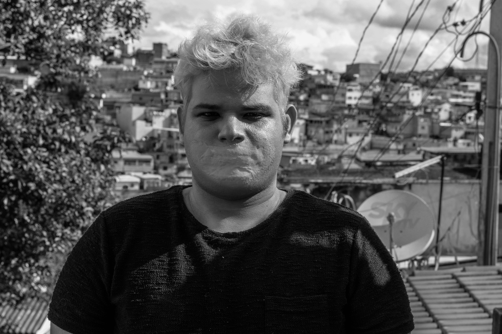
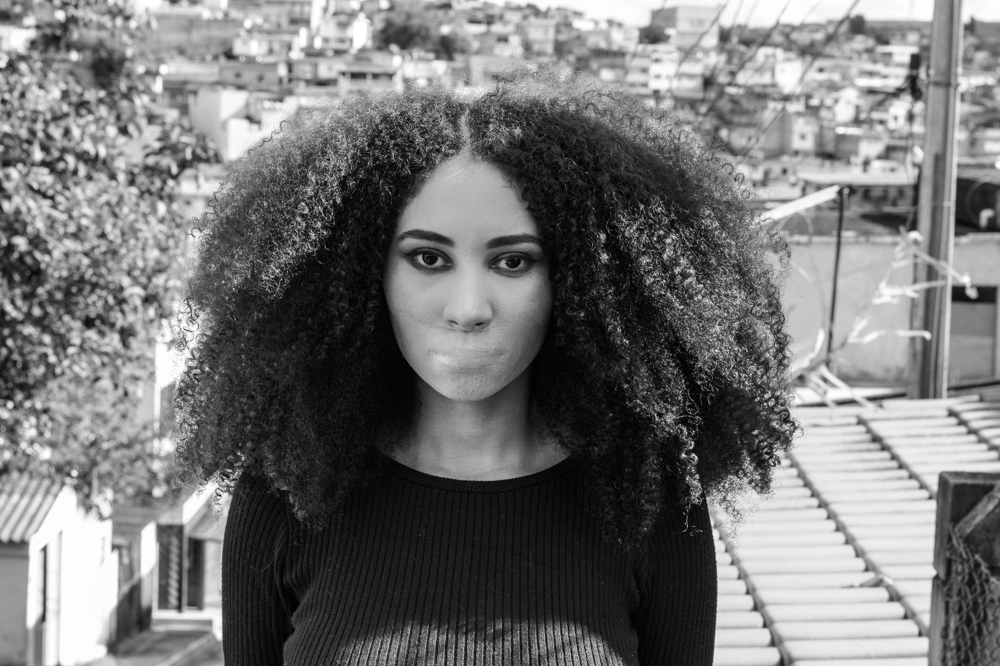
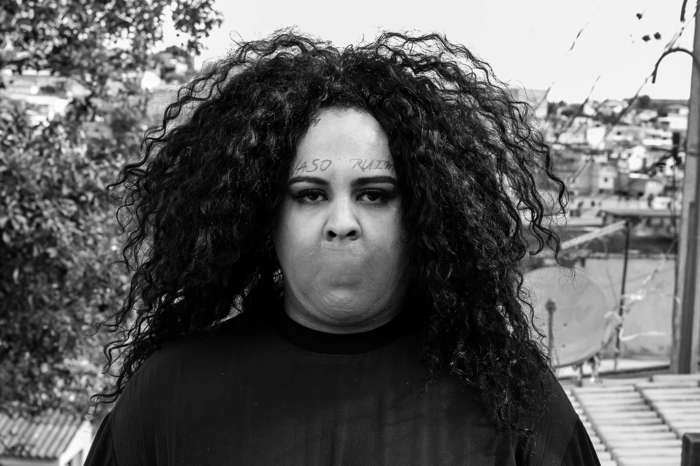
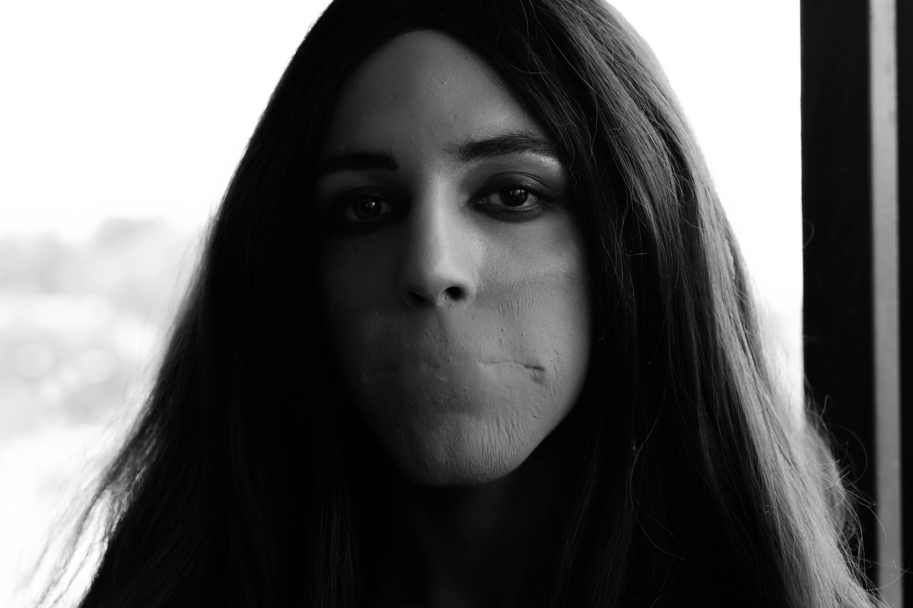
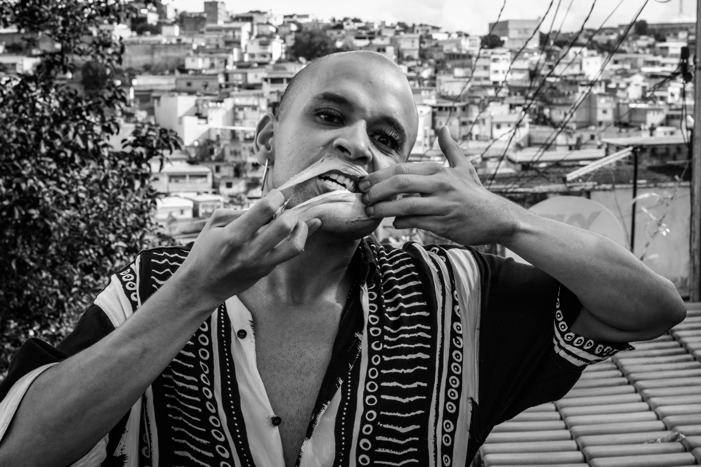

>“ O que pode um corpo? Perante a constituição, um corpo enquanto cidadão tem direitos assegurados por lei como acessibilidade, segurança, lazer, saúde, educação e cultura. Mas quais corpos realmente usufruem desses direitos?”

A maior parte dos integrantes do coletivo se conheceu durante o processo criativo do espetáculo Elogio ao Rato, apresentado na Fábrica de Cultura do Capão Redondo, em 2015. Vinícius criou a maquiagem e os figurinos da obra em colaboração com o elenco, originalmente maior. Após o projeto, os integrantes seguiram no teatro, na publicidade, e na música, em criações diferentes. Nesse período uma performer se descobriu transexual, outro drag queen, assumindo uma identidade queer, outra envereda pelo rap e pela performance ao lado de Linn da Quebrada,  num período onde o grupo se descobre queer, questionador e abrangente. Agora Vinícius, Jup,  Kitty, Carolina e Alef, se encontram para fundar o  Transcistada a partir de provocações individuais que se tornaram coletivas.

### Alef Carvalho

Performer. Começou a trabalhar com teatro em 2014, com a montagem do espetáculo Eu, Cavalo, no ano seguinte integrou o elenco do espetáculo Elogio ao Rato e Ensaio sobre a mancha, todos sob direção de Rodrigo Batista. Atualmente trabalha com criação de moda periférica no Capão Redondo, e é DJ em festas e casas noturnas de São Paulo.

### Carolina Santos

Performer. Estudou circo e teatro por dois anos, resultando na montagem do espetáculo Elogio ao Rato em 2015. Atualmente estuda publicidade e propaganda na Universidade Anhembi Morumbi.

### Jup do Bairro

Performer e cantora. Militante LGBTQ+ travesti, A Princesinha do Valo Velho (como é conhecida na sua quebrada) atua em diversas frentes artísticas, em espetáculos, performances, criações musicais e palestras. Recentemente Jup esteve em tour pela Europa com a cantora Linn da Quebrada, com quem também divide a cena no premiado filme Bixa Travesty.

### Kitty O”Reis

Performer e artista circense. Estreou no teatro com a montagem do espetáculo Elogio ao Rato, onde conheceu Carolina, Alef e Vinicius. Em seguida atuou em Ensaio sobre a mancha,  Navalha na carne - direção de Raoni Garcia,  Parangolé Grafite - direção Sandra Pestana, e Mãe Ventania – direção de Éder López, em temporadas em São Paulo.

### Vinicius Santana

Diretor e Performer. Graduado em artes cênicas pela Universidade de Brasília, trabalha  com dança e teatro há dez anos. Fez parte de cias de artes como o Esquadrão da Vida, e a AntiStatusQuo cia de dança.  Atuou na Opera Elektra, pelo Theatro Municipal de São Paulo, e faz parte do coletivo Bollywood Clown, em São Paulo. É o idealizador e diretor do projeto Transcistada e criador da drag queen Mackaylla Maria.

- Ficha Tecnica
Direção: Vinícius Santana
Produção: Canzuá Cultural e Vinícius Santana
Performers: Carolina Santos, Kitty O’Reis, Mackaylla Maria, Alef Carvalho e Jup do Bairro
Colaboração de pesquisa: Renata Carvalho e Raphael Jacques
Maquiagem: Transcistada
Cenário e desenho de luz: Daniel Roque e Felipe Tchaça
Figurino: Rafaelly Godoy
Projeções: Vinícius Santana e Cezar Renzi
Design Gráfico: Cezar Renzi
Fotografia: Bianca Ursini
